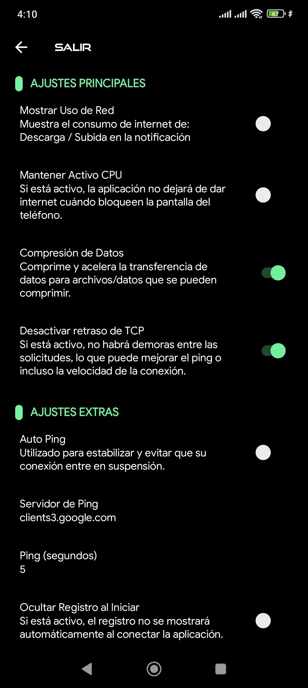

  

# 🛡️ ProNeet VPN

¡Bienvenido a la **descarga oficial** de **ProNeet VPN**!  
Una app confiable, rápida y lista para mantener tu conexión segura.

---

## 📲 Descargar APK

👉 Haz clic en el botón para descargar la **última versión** de nuestra app:

---

## 📸 Capturas de pantalla

| Pantalla principal |
|  |

| Configuración | 
 

|Registro|
|  |  

## 📡 Redes y contacto

Síguenos o únete a nuestros grupos para soporte, actualizaciones y novedades:

- 💬 WhatsApp: [Mensaje directo](https://wa.me/+593992852026)
- 👥 Grupo WhatsApp: [Unirse aquí](https://chat.whatsapp.com/GoKO7anWUlO0AcCgWbJXOS)
- 📢 Telegram: [Canal 1](https://t.me/netfre_ec) | [Canal 2](https://t.me/Netfree_Ec)
- 📘 Facebook: [ProNeet27](http://www.facebook.com/ProNeet27)
- 📸 Instagram: [@proneet.27](http://www.instagram.com/proneet.27)

---

## 🧠 Sobre ProNeet VPN

ProNeet VPN es una herramienta que permite conectividad segura y acceso estable a internet desde diferentes puntos del país.

- ⚡ Rápida
- 🔒 Segura
- 📶 Ideal para redes sociales, navegación y más

---

## ⚙️ Instalación

1. Descarga el archivo `.apk`.
2. Ábrelo desde tu móvil Android.
3. Si es tu primera vez, activa la opción de **"Permitir fuentes desconocidas"**.
4. ¡Instala y conéctate!

---

## ©️ Derechos

**ProNeet VPN** &copy; 2025 - Todos los derechos reservados.
